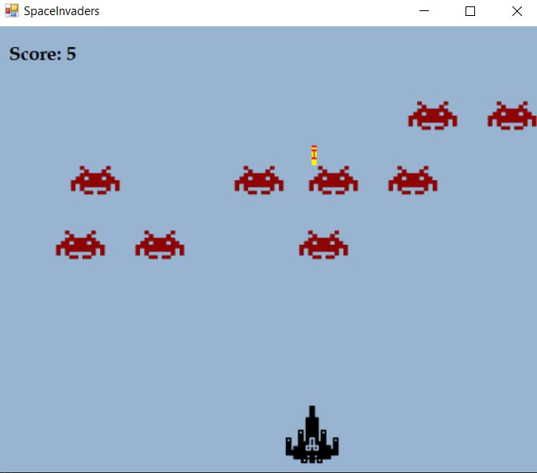

# Space Invaders
Project for Programming 2 in C#.

## Description
The aim of this project was to program the well-known Japanese game Space Invaders in C#. Animations are created using the Windows Forms.

## Description of the game for the user
The goal of the game is to shoot all invaders. There are 15 invaders, that are gradually approaching the player ship. During the game invaders can shoot the player or bump the player ship.

Player can shoot the invaders by pressing the space bar. Also player can move the player ship to left and right by pressing left and right buttons.

The invader speed increases when the player shot 8 invaders.

The game ends when:
 - player shot all invaders
 - invaders shot the player
 - invader's ship bump the player

To start new game user can press Enter. 

## Description of the game for the programmer
The program is written in C#. The graphics were made in Windows Forms. 

The main program is written in Form1.cs that has these methods:
 - KeyIsDown(object sender, KeyEventArgs e) - the method recognise when the user is pressing left or right button
 - KeyIsUp(object sender, KeyEventArgs e) - recognises when the user press Space bar, Left, Right and Enter buttons
 - GameSetup() - the method to set up the game (whole program starts from this method)
 - makeInvaders() - makes a certain amount of invaders, assigns tag, picture, size etc. to each invader
 - makeBullet() - the same method as for invaders, but also this method makes bullets with different tags for the player and for invaders
 - gameTimerEvent(object sender, EventArgs e) - main method with logic of the program
 - gameOver(string text) - stops the game and writes on the screen the message, how the game ended
 - removeAll() - removes all objects to start new game
